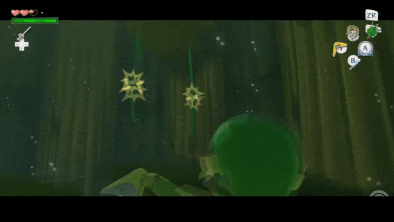
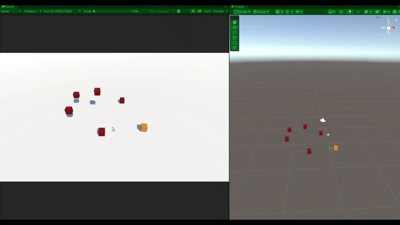
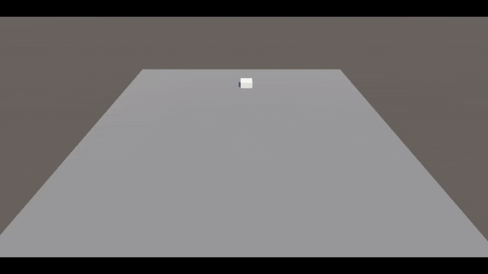

This was a project I started to get more familiar with working with 3D space in a game engine. I thought it would be interesting to try to recreate a game mechanic I was familiar with, so I chose the boomerang from The Legend of Zelda: The Wind Waker. 

The most interesting challenge for this was determining the correct mathematics to model the movement of the boomerang based on an ordered selection of targets. As a result, I got to re-familiarize myself with parametric equations and their usages. 

At first, I thought maybe a simple [Cardioid curve](https://mathworld.wolfram.com/Cardioid.html) would be a good base-representation of the boomerang's flight path, however, unlike the boomerang in other Legend of Zelda games, the unique thing about Wind Waker's is the ability to lock onto multiple targets, 

so we need a curve that interpolates between multiple points. 

With a bit more research, I landed on a [Catmull-Rom](https://en.wikipedia.org/wiki/Centripetal_Catmull%E2%80%93Rom_spline) spline implementation, that appeared to work really well; using the player and target positions as control points. 

```
public static Vector3 CatmullRomSpline(float t, int i, Vector3[] controlPoints, float tension = 0.5f)
{
    // Ensure valid index range
    int p0 = Mathf.Clamp(i - 1, 0, controlPoints.Length - 1);
    int p1 = i;
    int p2 = Mathf.Clamp(i + 1, 0, controlPoints.Length - 1);
    int p3 = Mathf.Clamp(i + 2, 0, controlPoints.Length - 1);

    // Catmull-Rom formula
    float t2 = t * t;
    float t3 = t2 * t;

    return tension * (
        (2f * controlPoints[p1]) +
        (-controlPoints[p0] + controlPoints[p2]) * t +
        (2f * controlPoints[p0] - 5f * controlPoints[p1] + 4f * controlPoints[p2] - controlPoints[p3]) * t2 +
        (-controlPoints[p0] + 3f * controlPoints[p1] - 3f * controlPoints[p2] + controlPoints[p3]) * t3
    );
}
```


At this point I was having a bit of fun with parametric equations, so I decided to implement the beginning of a simple enemy that would spawn from random points on a ground plane, and "dive" back into another random point,
```
private Vector3 RandomPoint(Plane p, float range)
{
    float x = Random.Range(-range, range);
    float z = Random.Range(-range, range);

    // Plane.normal = (A, B, C)
    // Plane.distance = D or -D ?
    float y = (-p.normal.x * x - p.normal.z * z - p.distance) / p.normal.y;

    return new Vector3(x, y, z);
}

// Generate a random tangent direction to find co-planar point to any random point
private Vector3 RandomTangentDirection(Plane p)
{
    // Generate a random direction perpendicular to the plane's normal
    // by using the cross product.
    Vector3 tangent = Vector3.Cross(p.normal, Vector3.up);
    // Handle edge case when plane normal is (0,1,0) ?
    if (tangent == Vector3.zero) tangent = Vector3.right;

    Vector3 bitangent = Vector3.Cross(p.normal, tangent).normalized;

    // Rotate some degrees around plane normal
    float angle = Random.Range(0f, 360f);
    Vector3 direction = Quaternion.AngleAxis(angle, p.normal) * bitangent;

    return direction.normalized;
}

private void RandomPointPair(Plane p, float distance, out Vector3 pointA, out Vector3 pointB)
{
    pointA = RandomPoint(p, distance);
    Vector3 randomDir = RandomTangentDirection(p);
    pointB = pointA + randomDir * distance;
}
```

similar to Volvagia from The Ocarina of Time.


